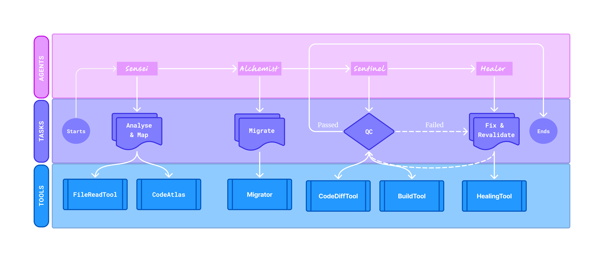

<p align="center">
  
</p>

# 🎭 PlayPorter — AI-Powered Selenium → Playwright Migration Crew

[](https://www.python.org/)
[](https://github.com/joaomdmoura/crewai)
[](https://playwright.dev/)
[](LICENSE)
[](https://github.com/marzooq23/playporter/actions)

---

**PlayPorter** is an agentic ecosystem built with [CrewAI](https://github.com/crewAIInc/crewAI) that intelligently migrates existing **Selenium** test frameworks to **Playwright**.

It uses a coordinated team of AI agents to:
- Analyze Selenium test suites
- Maps and stores code relationships in-memory 
- Migrates them into Playwright equivalents  
- Validate correctness via runtime testing  
- Review diffs between old and new code  
- Commit results to Git automatically  
- Generate a detailed migration report

---

## 🤖 Agentic Ecosystem

<p align="center">
  
</p>

| Agent | Role | Tools |
|--------|------|--------|
| **Sensei** | Understands Selenium test structures, reads source files, and maps locators and test flows into structured contexts for migration. | `FileReadTool`, `CodeAtlas` |
| **Alchemist** | Transforms Selenium code into Playwright syntax, manages element mappings, and commits generated scripts to the repository. | `SeleniumToPlaywrightConverter`, `Migrator` |
| **Sentinel** | Executes migrated Playwright tests, performs quality checks, and validates that behavior matches the Selenium baseline. | `PlaywrightRunnerTool`, `BuildTool`. `CodeDiffTool` |
| **Healer** | Detects flaky or failed migrations, applies automated repairs, and re-validates fixed scripts before closure. | `CodeDiffTool`, `HealingTool` |

---

## ⚙️ Setup & Usage

### 1️⃣ Create venv
```bash
python -m venv .venv

.\.venv\bin\Activate.ps1
```

### 2️⃣ Install Dependencies
```bash
python -m pip install --upgrade pip setuptools wheel

pip install -e .

pip install crewai crewai-tools playwright

npx playwright install chromium
```

### 3️⃣ Run PlayPorter
```bash
# Run the CLI (after installing this package)
playporter -m "selenium-framework-path" "path-for-new-playwright-framework"

# With Target Language Binding
playporter --migrate "selenium-framework-path" "path-for-new-playwright-framework" "typescript"

# Or run directly with Python (one-off)
python -m src.playporter.main --migrate "selenium-framework-path" "path-for-new-playwright-framework" "typescript"
```